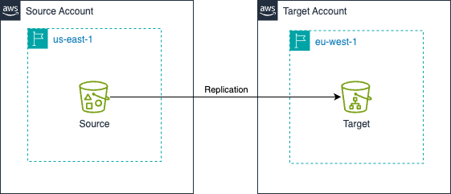

# AWS S3 Replication Terraform Module

This repository contains Terraform code to automate the creation and replication of AWS S3 buckets. It provisions a source and a destination bucket, sets up replication between them, and includes advanced features like moving data to Glacier storage for cost optimization.

## Features

- **Create Source and Destination S3 Buckets:**
  Automatically provisions both source and destination buckets for replication.

- **S3 Replication Configuration:**
  Sets up replication rules so that objects from the source bucket are copied to the destination bucket.

- **Glacier Transition:**
  Automatically transitions eligible objects to Amazon S3 Glacier for long-term, low-cost storage.

- **Read-Only Bucket Policy Example:**
  Includes an example of a read-only bucket policy for secure access (see `main.tf` for implementation).

- **Architecture Diagram:**
  

## Resources Created

- Source S3 Bucket
- Destination S3 Bucket
- IAM Role and Policy for Replication
- S3 Replication Configuration
- S3 Lifecycle Policy for Glacier Transition

## File Structure

```
.
├── assets/
│   └── arch.png        # Architecture diagram
├── main.tf             # Main Terraform code
├── variables.tf        # Input variables
├── outputs.tf          # Outputs
├── README.md           # This file
```

## Customization

- Edit `variables.tf` to change bucket names or enable/disable Glacier transition.
- Modify `main.tf` to adjust replication or lifecycle rules as needed.
